# AURA-Auction: Detailed Design Document

> **A Live, Intelligent Auction Arena — Fast · Fair · Secure**
>
> Course: Data Structures & Algorithms Analysis (DSAA) — Semester 2
> Date: March 22, 2026

---

## Table of Contents

1. [Executive Summary](#1-executive-summary)
2. [System Architecture](#2-system-architecture)
3. [Data Structures & Algorithms](#3-data-structures--algorithms)
4. [AI Fraud Detection Module](#4-ai-fraud-detection-module)
5. [Adaptive Rule Engine](#5-adaptive-rule-engine)
6. [Database Schema](#6-database-schema)
7. [API Design](#7-api-design)
8. [Business Logic Modules](#8-business-logic-modules)
9. [Security Architecture](#9-security-architecture)
10. [Frontend Architecture](#10-frontend-architecture)
11. [UML Diagrams](#11-uml-diagrams)
12. [Deployment Architecture](#12-deployment-architecture)
13. [Testing Strategy](#13-testing-strategy)
14. [Novelty & Patent Potential](#14-novelty--patent-potential)

---

## 1. Executive Summary

**AURA-Auction** is a real-time online auction platform that combines **high-performance data structures** with **AI-driven fraud detection** and **adaptive auction rules**. The system uses a **Max-Heap** to provide O(1) access to the highest bid, an **AI Behavioral Analyzer** to detect cheating patterns (fake bidding, collusion, sniping), and an **Adaptive Rule Engine** that dynamically changes auction parameters when fraud risk is elevated.

### Core Value Proposition

| Pillar | Implementation | Benefit |
|--------|---------------|---------|
| **Fast Auction** | Max-Heap + WebSocket real-time updates | O(1) highest-bid retrieval, instant updates |
| **Fair Auction** | AI fraud detection + adaptive rules | Catches collusion, shill bidding, and sniping |
| **Secure Auction** | HMAC-signed audit logs, MFA, RBAC | Tamper-proof records, strong identity |

---

## 2. System Architecture

### 2.1 High-Level Architecture (Layered)

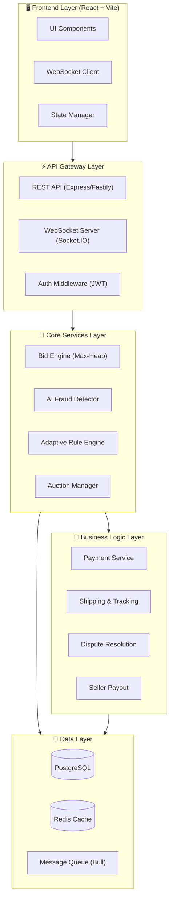

### 2.2 Component Interaction Summary

| Component | Communicates With | Protocol |
|-----------|------------------|----------|
| Frontend → API Gateway | REST, WebSocket | HTTPS, WSS |
| API Gateway → Bid Engine | Internal function call | In-process |
| Bid Engine → Fraud Detector | Event-driven | Redis Pub/Sub |
| Fraud Detector → Rule Engine | Trigger callback | In-process |
| Rule Engine → Auction Manager | Parameter update | In-process |
| Auction Manager → Payment Service | Async message | Bull Queue |
| Payment Service → Shipping | Event on success | Bull Queue |

---

## 3. Data Structures & Algorithms

### 3.1 Max-Heap (Core Bid Management)

The **Max-Heap** is the central data structure that powers the real-time bidding system. It ensures the highest bid is always accessible in **O(1)** time while insertions and deletions run in **O(log n)**.

#### Why Max-Heap?

| Approach | Insert | Get Max | Delete Max | Space |
|----------|--------|---------|------------|-------|
| Unsorted Array | O(1) | O(n) | O(n) | O(n) |
| Sorted Array | O(n) | O(1) | O(1) | O(n) |
| **Max-Heap** ✅ | **O(log n)** | **O(1)** | **O(log n)** | **O(n)** |
| BST (balanced) | O(log n) | O(log n) | O(log n) | O(n) |

**Verdict**: Max-Heap gives us the best balance — constant-time access to the winning bid with logarithmic insertion, which is critical for high-frequency live auctions.

#### Class Design

```typescript
class BidMaxHeap {
  private heap: Bid[] = [];

  // O(1) — Get the current highest bid
  getMax(): Bid | null {
    return this.heap.length > 0 ? this.heap[0] : null;
  }

  // O(log n) — Insert a new bid and bubble up
  insert(bid: Bid): void {
    this.heap.push(bid);
    this.bubbleUp(this.heap.length - 1);
    this.onNewBid(bid); // triggers fraud check + broadcast
  }

  // O(log n) — Remove the highest bid (for cancellation/fraud)
  extractMax(): Bid | null {
    if (this.heap.length === 0) return null;
    const max = this.heap[0];
    const last = this.heap.pop()!;
    if (this.heap.length > 0) {
      this.heap[0] = last;
      this.sinkDown(0);
    }
    return max;
  }

  // O(n) — Get top-K bids for analytics/history display
  getTopK(k: number): Bid[] {
    const sorted = [...this.heap].sort((a, b) => b.amount - a.amount);
    return sorted.slice(0, k);
  }

  // Internal: Bubble up after insert
  private bubbleUp(index: number): void {
    while (index > 0) {
      const parentIdx = Math.floor((index - 1) / 2);
      if (this.heap[index].amount <= this.heap[parentIdx].amount) break;
      [this.heap[index], this.heap[parentIdx]] = 
        [this.heap[parentIdx], this.heap[index]];
      index = parentIdx;
    }
  }

  // Internal: Sink down after extraction
  private sinkDown(index: number): void {
    const length = this.heap.length;
    while (true) {
      let largest = index;
      const left = 2 * index + 1;
      const right = 2 * index + 2;
      if (left < length && this.heap[left].amount > this.heap[largest].amount)
        largest = left;
      if (right < length && this.heap[right].amount > this.heap[largest].amount)
        largest = right;
      if (largest === index) break;
      [this.heap[index], this.heap[largest]] = 
        [this.heap[largest], this.heap[index]];
      index = largest;
    }
  }

  private onNewBid(bid: Bid): void {
    // 1. Emit WebSocket event to all connected clients
    // 2. Trigger AI fraud analysis pipeline
    // 3. Log to audit trail
  }
}
```

#### Heap Operations Visualization

```
Insert $45,200 into heap:

Before:                    After bubbleUp:
      $28,500                   $45,200
      /     \                   /     \
  $12,750  $14,300         $28,500  $14,300
  /    \                   /    \
$8,900 $12,750          $8,900 $12,750

Array: [28500, 12750, 14300, 8900, 12750]
     → [45200, 28500, 14300, 8900, 12750]
```

### 3.2 Hash Map (O(1) Auction/User Lookups)

```typescript
// Fast auction lookups by ID
const auctionRegistry: Map<string, Auction> = new Map();

// Fast session management
const activeSessions: Map<string, UserSession> = new Map();

// Bid history per auction (for fraud analysis)
const bidHistoryIndex: Map<string, Bid[]> = new Map();
```

| Operation | Time Complexity |
|-----------|----------------|
| Get auction by ID | O(1) |
| Get user session | O(1) |
| Get bid history for auction | O(1) |

### 3.3 Graph (Collusion Detection Network)

A **directed graph** models relationships between bidders. Edges represent "has bid against" relationships, and edge weights capture interaction frequency.

```typescript
class BidderGraph {
  private adjacencyList: Map<string, Map<string, EdgeData>> = new Map();

  addInteraction(bidderA: string, bidderB: string, auctionId: string): void {
    if (!this.adjacencyList.has(bidderA))
      this.adjacencyList.set(bidderA, new Map());
    
    const edges = this.adjacencyList.get(bidderA)!;
    if (!edges.has(bidderB)) {
      edges.set(bidderB, { weight: 0, auctions: [] });
    }
    
    const edge = edges.get(bidderB)!;
    edge.weight++;
    edge.auctions.push(auctionId);
  }

  // Detect collusion rings using cycle detection (DFS)
  detectCollusionRings(): string[][] {
    const visited = new Set<string>();
    const recStack = new Set<string>();
    const rings: string[][] = [];

    for (const [node] of this.adjacencyList) {
      if (!visited.has(node)) {
        this.dfs(node, visited, recStack, [], rings);
      }
    }
    return rings;
  }

  private dfs(
    node: string,
    visited: Set<string>,
    recStack: Set<string>,
    path: string[],
    rings: string[][]
  ): void {
    visited.add(node);
    recStack.add(node);
    path.push(node);

    const neighbors = this.adjacencyList.get(node) || new Map();
    for (const [neighbor, edge] of neighbors) {
      if (!visited.has(neighbor)) {
        this.dfs(neighbor, visited, recStack, path, rings);
      } else if (recStack.has(neighbor) && edge.weight >= 3) {
        // Cycle detected with high interaction → potential collusion
        const cycleStart = path.indexOf(neighbor);
        rings.push(path.slice(cycleStart));
      }
    }

    path.pop();
    recStack.delete(node);
  }
}
```

### 3.4 Queue (Event Processing Pipeline)

```typescript
// Priority queue for processing fraud alerts (highest risk first)
class FraudAlertQueue {
  private heap: FraudAlert[] = []; // Min-heap by priority (1 = critical)

  enqueue(alert: FraudAlert): void { /* heap insert */ }
  dequeue(): FraudAlert | null { /* heap extract-min */ }
  peek(): FraudAlert | null { return this.heap[0] ?? null; }
}

// FIFO queue for audit log writes (maintains chronological order)
class AuditLogQueue {
  private buffer: AuditEntry[] = [];
  
  enqueue(entry: AuditEntry): void { this.buffer.push(entry); }
  flush(): AuditEntry[] { return this.buffer.splice(0); }
}
```

### 3.5 Algorithm Complexity Summary

| Operation | Data Structure | Time | Space |
|-----------|---------------|------|-------|
| Get highest bid | Max-Heap | O(1) | O(n) |
| Place new bid | Max-Heap insert | O(log n) | O(1) |
| Cancel fraudulent bid | Max-Heap extract | O(log n) | O(1) |
| Lookup auction/user | Hash Map | O(1) | O(n) |
| Detect collusion rings | Graph DFS | O(V + E) | O(V) |
| Process fraud alert | Priority Queue | O(log n) | O(n) |
| Bidder time-series analysis | Sliding Window | O(k) | O(k) |

---

## 4. AI Fraud Detection Module

### 4.1 Fraud Types Detected

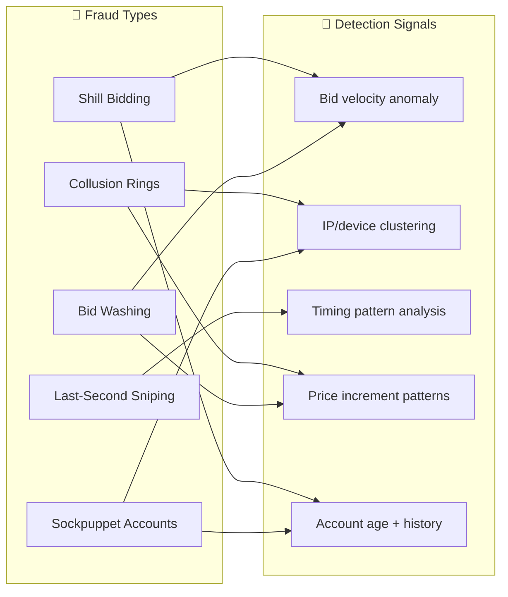

### 4.2 Feature Vector Design

Each bid generates a feature vector for the AI model:

```typescript
interface BidFeatureVector {
  // Temporal features
  timeSinceLastBid: number;        // seconds
  bidVelocity: number;             // bids/minute in last 5 min
  timeToAuctionEnd: number;        // seconds remaining
  hourOfDay: number;               // 0-23
  
  // Price features
  bidIncrement: number;            // absolute $ increase
  bidIncrementPct: number;         // % increase over previous bid
  priceToEstimateRatio: number;    // bid / estimated fair value
  
  // Behavioral features
  userTotalBids: number;           // lifetime bids by this user
  userWinRate: number;             // % of auctions won
  bidRetractionRate: number;       // % of bids retracted
  accountAgeDays: number;          // days since registration
  
  // Network features
  sharedIPCount: number;           // # of users sharing IP
  sharedDeviceFingerprint: number; // # matching device fingerprints
  interactionFrequency: number;    // # times bid against same users
  
  // Auction context
  auctionBidCount: number;         // total bids on this auction
  uniqueBidderCount: number;       // unique bidders
  reserveMetRatio: number;         // current_bid / reserve_price
}
```

### 4.3 Scoring Algorithm (Weighted Risk Score)

The system computes a **composite fraud risk score** (0.0 – 1.0) using weighted signals:

```typescript
class FraudScorer {
  private weights: Record<string, number> = {
    bidVelocityAnomaly: 0.20,
    pricePatternAnomaly: 0.15,
    timingAnomaly: 0.15,
    networkAnomaly: 0.25,    // Highest weight — hardest to fake
    accountTrustScore: 0.15,
    historicalPattern: 0.10,
  };

  computeRiskScore(features: BidFeatureVector): FraudResult {
    const signals: Record<string, number> = {
      bidVelocityAnomaly: this.checkBidVelocity(features),
      pricePatternAnomaly: this.checkPricePattern(features),
      timingAnomaly: this.checkTimingPattern(features),
      networkAnomaly: this.checkNetworkSignals(features),
      accountTrustScore: this.checkAccountTrust(features),
      historicalPattern: this.checkHistory(features),
    };

    let totalScore = 0;
    for (const [key, weight] of Object.entries(this.weights)) {
      totalScore += signals[key] * weight;
    }

    return {
      riskScore: Math.min(1.0, totalScore),
      riskLevel: this.classifyRisk(totalScore),
      signals,
      recommendedAction: this.getAction(totalScore),
    };
  }

  private classifyRisk(score: number): RiskLevel {
    if (score < 0.3) return 'LOW';
    if (score < 0.6) return 'MEDIUM';
    if (score < 0.8) return 'HIGH';
    return 'CRITICAL';
  }

  private getAction(score: number): string {
    if (score >= 0.8) return 'BLOCK_AND_REVIEW';
    if (score >= 0.6) return 'APPLY_ADAPTIVE_RULES';
    if (score >= 0.3) return 'FLAG_FOR_MONITORING';
    return 'ALLOW';
  }
}
```

### 4.4 Cheating Detection Algorithms

#### Shill Bidding Detection (Sliding Window + Statistical Analysis)

```typescript
function detectShillBidding(
  bids: Bid[],
  windowSize: number = 10
): boolean {
  // Sliding window over last N bids
  for (let i = windowSize; i < bids.length; i++) {
    const window = bids.slice(i - windowSize, i);
    
    // Check 1: Same bidder pattern (bid → outbid → bid → outbid)
    const bidderCounts = new Map<string, number>();
    window.forEach(b => {
      bidderCounts.set(b.bidderId, (bidderCounts.get(b.bidderId) || 0) + 1);
    });
    
    // Flag: any bidder has > 40% of bids in window
    for (const [, count] of bidderCounts) {
      if (count / windowSize > 0.4) return true;
    }
    
    // Check 2: Minimal increments (consistently bidding just above)
    const increments = window.map((b, idx) =>
      idx > 0 ? b.amount - window[idx - 1].amount : 0
    ).filter(i => i > 0);
    
    const avgIncrement = increments.reduce((s, i) => s + i, 0) / increments.length;
    const stdDev = Math.sqrt(
      increments.reduce((s, i) => s + (i - avgIncrement) ** 2, 0) / increments.length
    );
    
    // Flag: very low variance = robotic/scripted bidding
    if (stdDev / avgIncrement < 0.1) return true;
  }
  return false;
}
```

#### Last-Second Sniping Detection

```typescript
function detectSniping(
  bid: Bid,
  auctionEndTime: Date,
  threshold: number = 10 // seconds
): SnipingResult {
  const secondsRemaining = 
    (auctionEndTime.getTime() - new Date(bid.timestamp).getTime()) / 1000;
  
  if (secondsRemaining <= threshold) {
    return {
      isSniping: true,
      secondsRemaining,
      action: 'EXTEND_AUCTION', // Anti-snipe extension
      extensionSeconds: 120,     // Add 2 minutes
    };
  }
  return { isSniping: false, secondsRemaining, action: 'NONE' };
}
```

---

## 5. Adaptive Rule Engine

### 5.1 Rule Triggers & Actions

When fraud risk crosses defined thresholds, the rule engine automatically adjusts auction parameters:

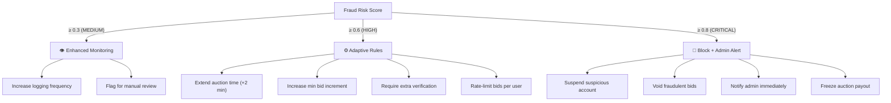

### 5.2 Rule Engine Implementation

```typescript
interface AdaptiveRule {
  id: string;
  name: string;
  condition: (ctx: AuctionContext) => boolean;
  action: (ctx: AuctionContext) => void;
  priority: number; // Lower = higher priority
  cooldownMs: number; // Prevent rule from firing repeatedly
}

class AdaptiveRuleEngine {
  private rules: AdaptiveRule[] = [];
  private lastFired: Map<string, number> = new Map();

  registerRule(rule: AdaptiveRule): void {
    this.rules.push(rule);
    this.rules.sort((a, b) => a.priority - b.priority);
  }

  evaluate(ctx: AuctionContext): AppliedRule[] {
    const applied: AppliedRule[] = [];
    
    for (const rule of this.rules) {
      const lastFiredAt = this.lastFired.get(rule.id) || 0;
      const cooldownPassed = Date.now() - lastFiredAt > rule.cooldownMs;
      
      if (cooldownPassed && rule.condition(ctx)) {
        rule.action(ctx);
        this.lastFired.set(rule.id, Date.now());
        applied.push({ ruleId: rule.id, name: rule.name, timestamp: new Date() });
      }
    }
    
    return applied;
  }
}

// Example rules
const antiSnipeRule: AdaptiveRule = {
  id: 'anti-snipe',
  name: 'Anti-Snipe Time Extension',
  priority: 1,
  cooldownMs: 30_000, // 30 seconds
  condition: (ctx) => {
    const secsRemaining = (ctx.auction.endTime.getTime() - Date.now()) / 1000;
    return secsRemaining <= 10 && ctx.latestBid !== null;
  },
  action: (ctx) => {
    ctx.auction.endTime = new Date(ctx.auction.endTime.getTime() + 120_000);
    ctx.broadcast('AUCTION_EXTENDED', { newEndTime: ctx.auction.endTime });
  },
};

const minBidIncrease: AdaptiveRule = {
  id: 'min-bid-increase',
  name: 'Increase Minimum Bid Increment',
  priority: 2,
  cooldownMs: 300_000, // 5 minutes
  condition: (ctx) => ctx.fraudScore >= 0.6,
  action: (ctx) => {
    ctx.auction.minIncrement = Math.max(
      ctx.auction.minIncrement * 2,
      ctx.auction.currentBid * 0.05 // At least 5% of current bid
    );
    ctx.broadcast('RULES_UPDATED', {
      minIncrement: ctx.auction.minIncrement,
      reason: 'Increased security measures applied',
    });
  },
};

const verificationRequired: AdaptiveRule = {
  id: 'extra-verification',
  name: 'Require Extra Verification',
  priority: 3,
  cooldownMs: 600_000, // 10 minutes
  condition: (ctx) => ctx.fraudScore >= 0.7,
  action: (ctx) => {
    ctx.requireMFA = true;
    ctx.broadcast('VERIFICATION_REQUIRED', {
      message: 'Additional identity verification required to continue bidding',
    });
  },
};
```

### 5.3 Rule Decision Matrix

| Fraud Score | Time Left | Bid Velocity | Action |
|-------------|-----------|-------------|--------|
| < 0.3 | Any | Normal | ✅ Allow |
| 0.3 — 0.6 | > 5 min | Normal | 👁️ Monitor |
| 0.3 — 0.6 | ≤ 5 min | High | ⏱️ Extend + Monitor |
| 0.6 — 0.8 | Any | Any | ⚙️ Increase min increment + Rate limit |
| ≥ 0.8 | Any | Any | 🛑 Block user + Void bids + Alert admin |

---

## 6. Database Schema

### 6.1 Entity-Relationship Diagram

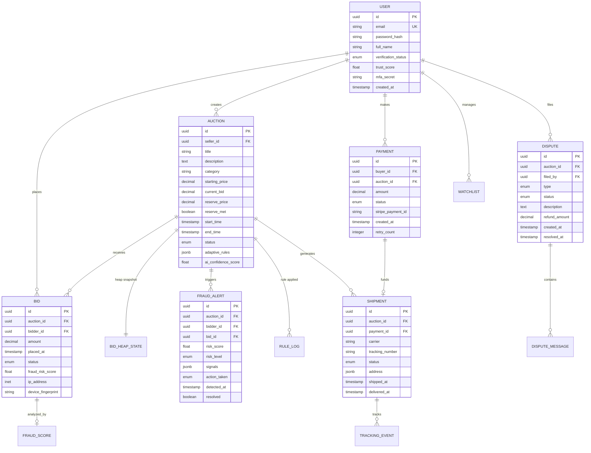

### 6.2 Key Indexes

```sql
-- Hot path: get all bids for an auction, ordered by amount
CREATE INDEX idx_bids_auction_amount 
  ON bids (auction_id, amount DESC);

-- Fraud detection: recent bids by a user across auctions
CREATE INDEX idx_bids_bidder_time 
  ON bids (bidder_id, placed_at DESC);

-- Active auctions sorted by end time
CREATE INDEX idx_auctions_active 
  ON auctions (status, end_time) 
  WHERE status IN ('live', 'ending_soon');

-- Fraud alerts pending review
CREATE INDEX idx_fraud_unresolved 
  ON fraud_alerts (resolved, risk_level DESC) 
  WHERE resolved = false;
```

---

## 7. API Design

### 7.1 REST Endpoints

| Method | Endpoint | Auth | Description |
|--------|----------|------|-------------|
| `POST` | `/api/auth/register` | — | Create account |
| `POST` | `/api/auth/login` | — | Login, get JWT |
| `POST` | `/api/auth/mfa/verify` | JWT | Verify MFA code |
| `GET` | `/api/auctions` | — | List active auctions |
| `GET` | `/api/auctions/:id` | — | Auction detail |
| `POST` | `/api/auctions` | Seller | Create auction |
| `POST` | `/api/auctions/:id/bids` | Buyer | Place bid |
| `GET` | `/api/auctions/:id/bids` | — | Bid history |
| `GET` | `/api/me/bids` | JWT | My active bids |
| `GET` | `/api/me/watchlist` | JWT | My watchlist |
| `POST` | `/api/me/watchlist/:auctionId` | JWT | Add to watchlist |
| `POST` | `/api/payments/initiate` | JWT | Start payment |
| `GET` | `/api/shipments/:id/track` | JWT | Track delivery |
| `POST` | `/api/disputes` | JWT | File a dispute |
| `GET` | `/api/admin/fraud-alerts` | Admin | View fraud alerts |
| `POST` | `/api/admin/auctions/:id/rules` | Admin | Override rules |

### 7.2 WebSocket Events

```typescript
// Client → Server
interface ClientEvents {
  'bid:place': { auctionId: string; amount: number };
  'auction:subscribe': { auctionId: string };
  'auction:unsubscribe': { auctionId: string };
}

// Server → Client
interface ServerEvents {
  'bid:new': { bid: Bid; heapSize: number };
  'bid:rejected': { reason: string; fraudScore?: number };
  'auction:updated': { currentBid: number; bidCount: number };
  'auction:extended': { newEndTime: string; reason: string };
  'auction:ended': { winnerId: string; finalPrice: number };
  'rules:changed': { newMinIncrement: number; message: string };
  'verification:required': { type: 'mfa' | 'id_check' };
  'fraud:alert': { level: string; message: string }; // admin only
}
```

### 7.3 Bid Placement Flow (Sequence)

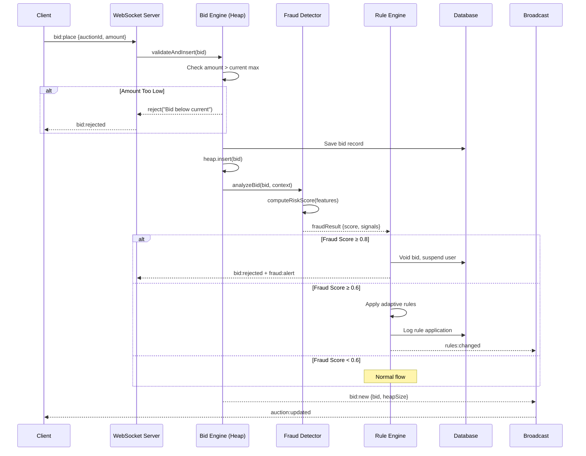

---

## 8. Business Logic Modules

### 8.1 Payment Processing

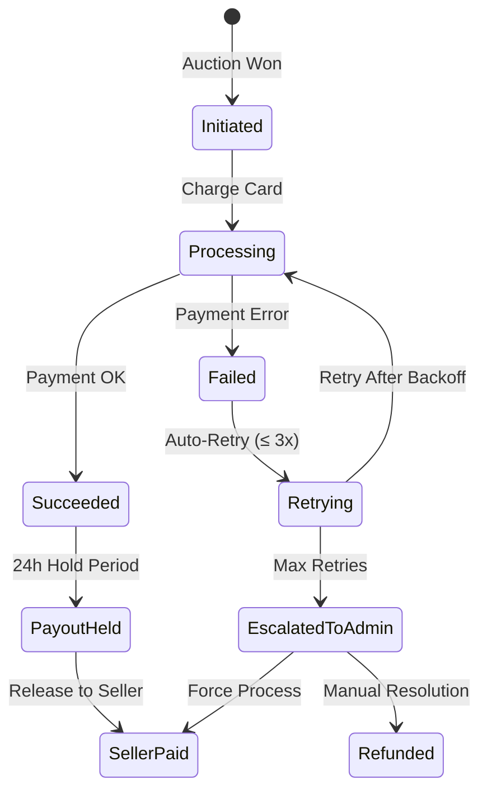

```typescript
class PaymentService {
  async processWinnerPayment(auctionId: string): Promise<void> {
    const auction = await this.auctionRepo.findById(auctionId);
    const winner = await this.bidHeap.getMax();
    
    const payment = await this.createPayment({
      buyerId: winner.bidderId,
      auctionId,
      amount: winner.amount,
      status: 'initiated',
    });

    try {
      const charge = await this.stripe.charges.create({
        amount: Math.round(winner.amount * 100),
        currency: 'usd',
        customerId: winner.stripeCustomerId,
      });
      
      payment.status = 'succeeded';
      payment.stripePaymentId = charge.id;
      
      // Schedule payout to seller after 24h hold
      await this.payoutQueue.add('release-payout', {
        paymentId: payment.id,
        sellerId: auction.sellerId,
      }, { delay: 24 * 60 * 60 * 1000 });
      
    } catch (error) {
      payment.status = 'failed';
      payment.retryCount++;
      
      if (payment.retryCount < 3) {
        // Exponential backoff retry
        await this.paymentQueue.add('retry-payment', {
          paymentId: payment.id,
        }, { delay: Math.pow(2, payment.retryCount) * 60_000 });
      } else {
        await this.notifyAdmin('PAYMENT_FAILURE', { payment, auction });
      }
    }
    
    await this.paymentRepo.save(payment);
  }
}
```

### 8.2 Shipping & Delivery Tracking

```typescript
interface ShipmentTracker {
  createShipment(auctionId: string, address: Address): Promise<Shipment>;
  updateTracking(shipmentId: string, event: TrackingEvent): void;
  getTrackingHistory(shipmentId: string): Promise<TrackingEvent[]>;
}

// Tracking events stored with timestamps for full visibility
interface TrackingEvent {
  status: 'label_created' | 'picked_up' | 'in_transit' 
        | 'out_for_delivery' | 'delivered' | 'exception';
  location: string;
  timestamp: Date;
  details: string;
}
```

### 8.3 Dispute Resolution

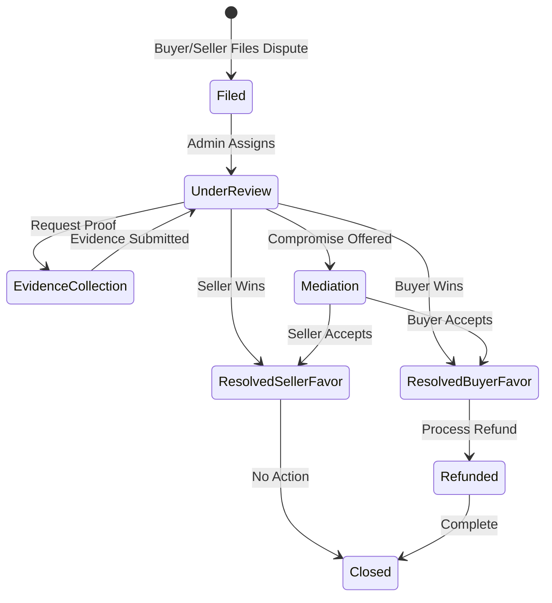

### 8.4 Seller Payout

```typescript
class PayoutService {
  async releasePayout(paymentId: string, sellerId: string): Promise<void> {
    const payment = await this.paymentRepo.findById(paymentId);
    
    // Deduct platform fee (e.g., 5%)
    const platformFee = payment.amount * 0.05;
    const sellerAmount = payment.amount - platformFee;
    
    // Check for disputes or fraud holds
    const hasActiveDispute = await this.disputeRepo.hasActive(payment.auctionId);
    if (hasActiveDispute) {
      // Hold payout until dispute is resolved
      return;
    }
    
    await this.stripe.transfers.create({
      amount: Math.round(sellerAmount * 100),
      currency: 'usd',
      destination: seller.stripeAccountId,
    });
    
    await this.auditLog.write({
      type: 'PAYOUT_RELEASED',
      sellerId,
      amount: sellerAmount,
      paymentId,
    });
  }
}
```

---

## 9. Security Architecture

### 9.1 Authentication & Authorization

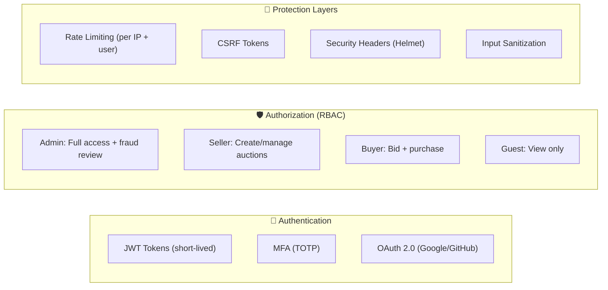

### 9.2 HMAC-Signed Audit Logs (Tamper-Proof)

Every critical action (bid placed, rule changed, fraud alert, payout) is logged with an **HMAC signature** to prevent tampering:

```typescript
class SignedAuditLogger {
  private secret: Buffer;

  constructor(hmacSecret: string) {
    this.secret = Buffer.from(hmacSecret, 'hex');
  }

  log(entry: AuditEntry): SignedAuditEntry {
    const payload = JSON.stringify({
      ...entry,
      timestamp: new Date().toISOString(),
      previousHash: this.getLastHash(),
    });

    // HMAC-SHA256 chained signature
    const signature = crypto
      .createHmac('sha256', this.secret)
      .update(payload)
      .digest('hex');

    const signedEntry: SignedAuditEntry = {
      ...entry,
      timestamp: new Date(),
      signature,
      previousHash: this.getLastHash(),
    };

    this.store(signedEntry);
    return signedEntry;
  }

  // Verify log chain integrity
  verifyChain(): { valid: boolean; brokenAt?: number } {
    const entries = this.getAllEntries();
    
    for (let i = 1; i < entries.length; i++) {
      const expected = crypto
        .createHmac('sha256', this.secret)
        .update(JSON.stringify({
          type: entries[i].type,
          data: entries[i].data,
          timestamp: entries[i].timestamp,
          previousHash: entries[i - 1].signature,
        }))
        .digest('hex');

      if (expected !== entries[i].signature) {
        return { valid: false, brokenAt: i };
      }
    }
    return { valid: true };
  }
}
```

### 9.3 Security Measures Summary

| Layer | Measure | Implementation |
|-------|---------|---------------|
| **Transport** | TLS 1.3 | Nginx reverse proxy |
| **Identity** | JWT + MFA | `jsonwebtoken` + `speakeasy` |
| **Authorization** | RBAC | Middleware guards |
| **Input** | Validation + Sanitization | `zod` schemas + `DOMPurify` |
| **Rate Limiting** | Per-IP and per-user | `express-rate-limit` |
| **Audit** | HMAC-signed chain | SHA-256 chained logs |
| **Data** | Encryption at rest | AES-256, PostgreSQL TDE |
| **Secrets** | Env vault | `.env` + `dotenv-vault` |

---

## 10. Frontend Architecture

### 10.1 Existing Component Map

The current React + Vite + Tailwind frontend is already built with:

| Component | File | Purpose |
|-----------|------|---------|
| `Layout` | [Layout.tsx](file:///e:/clg%20work/work/sem2/DSA/Create%20Detailed%20Design/src/app/components/Layout.tsx) | App shell with navigation |
| `AuctionCard` | [AuctionCard.tsx](file:///e:/clg%20work/work/sem2/DSA/Create%20Detailed%20Design/src/app/components/AuctionCard.tsx) | Auction listing tiles |
| [BidButton](file:///e:/clg%20work/work/sem2/DSA/Create%20Detailed%20Design/src/app/components/BidButton.tsx#11-165) | [BidButton.tsx](file:///e:/clg%20work/work/sem2/DSA/Create%20Detailed%20Design/src/app/components/BidButton.tsx) | Interactive bid placement UI |
| `BidHistoryTimeline` | [BidHistoryTimeline.tsx](file:///e:/clg%20work/work/sem2/DSA/Create%20Detailed%20Design/src/app/components/BidHistoryTimeline.tsx) | Chronological bid display |
| `CountdownTimer` | [CountdownTimer.tsx](file:///e:/clg%20work/work/sem2/DSA/Create%20Detailed%20Design/src/app/components/CountdownTimer.tsx) | Live countdown with pulse |
| `FiltersPanel` | [FiltersPanel.tsx](file:///e:/clg%20work/work/sem2/DSA/Create%20Detailed%20Design/src/app/components/FiltersPanel.tsx) | Category/price/status filters |
| `NotificationTray` | [NotificationTray.tsx](file:///e:/clg%20work/work/sem2/DSA/Create%20Detailed%20Design/src/app/components/NotificationTray.tsx) | Real-time notifications |
| `UserBadge` | [UserBadge.tsx](file:///e:/clg%20work/work/sem2/DSA/Create%20Detailed%20Design/src/app/components/UserBadge.tsx) | Seller/buyer verification badge |
| `LiveActivityIndicator` | [LiveActivityIndicator.tsx](file:///e:/clg%20work/work/sem2/DSA/Create%20Detailed%20Design/src/app/components/LiveActivityIndicator.tsx) | Real-time activity pulse |

### 10.2 Page Routing

| Route | Page | Description |
|-------|------|-------------|
| `/` | [Home.tsx](file:///e:/clg%20work/work/sem2/DSA/Create%20Detailed%20Design/src/app/pages/Home.tsx) | Trending + all auctions grid |
| `/auction/:id` | [AuctionDetail.tsx](file:///e:/clg%20work/work/sem2/DSA/Create%20Detailed%20Design/src/app/pages/AuctionDetail.tsx) | Full bidding interface |
| `/buyer-dashboard` | [BuyerDashboard.tsx](file:///e:/clg%20work/work/sem2/DSA/Create%20Detailed%20Design/src/app/pages/BuyerDashboard.tsx) | Active bids + watchlist |
| `/seller-dashboard` | [SellerDashboard.tsx](file:///e:/clg%20work/work/sem2/DSA/Create%20Detailed%20Design/src/app/pages/SellerDashboard.tsx) | Analytics + listings |
| `/watchlist` | [Watchlist.tsx](file:///e:/clg%20work/work/sem2/DSA/Create%20Detailed%20Design/src/app/pages/Watchlist.tsx) | Saved auctions |

### 10.3 New Components Needed

| Component | Purpose |
|-----------|---------|
| `FraudAlertBanner` | Shows real-time fraud detection alerts to admin |
| `TrustScoreBadge` | Shows AI trust/risk score on bids |
| `AdaptiveRuleNotice` | Informs users when rules change mid-auction |
| `PaymentFlow` | Stripe checkout integration |
| `ShipmentTracker` | Visual delivery timeline |
| `DisputeForm` | File and manage disputes |
| `AdminPanel` | Fraud queue, rule overrides, user management |
| `MFADialog` | Two-factor authentication prompt |

### 10.4 Real-Time Data Flow

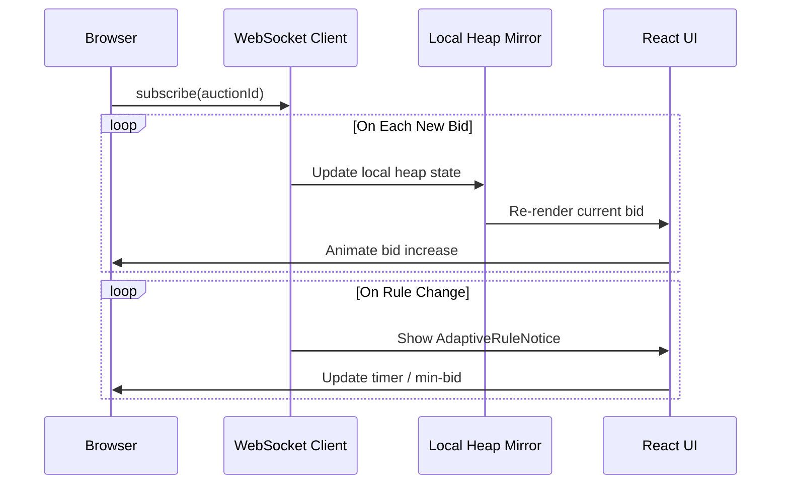

---

## 11. UML Diagrams

### 11.1 Class Diagram (Core Domain)

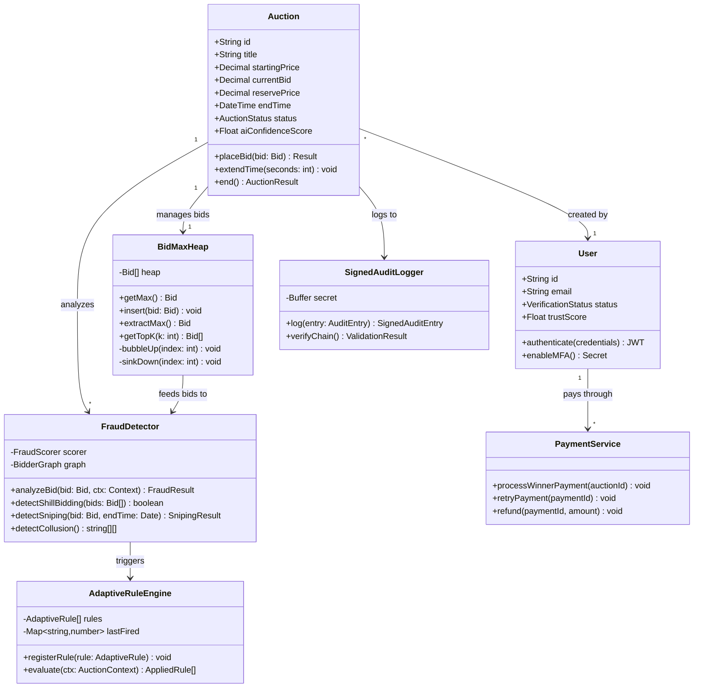

### 11.2 Component Diagram

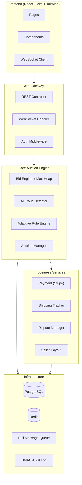

### 11.3 Use Case Diagram

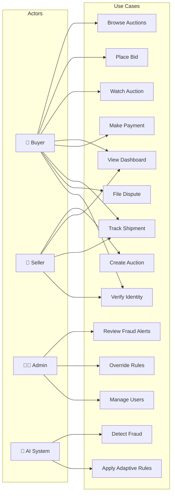

---

## 12. Deployment Architecture

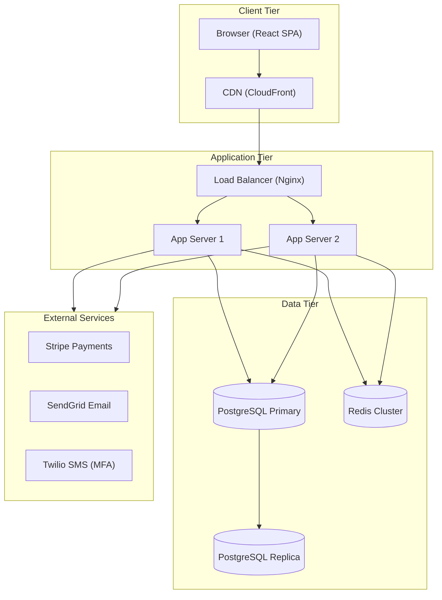

### 12.1 Infrastructure Specs

| Component | Technology | Purpose |
|-----------|-----------|---------|
| Frontend Hosting | Vercel / Netlify | React SPA + CDN |
| Backend | Node.js (Express/Fastify) | API + WebSocket server |
| Database | PostgreSQL 16 | Primary data store |
| Cache | Redis 7 | Session, heap state, pub/sub |
| Queue | Bull (Redis-backed) | Async jobs (payments, payouts) |
| Payments | Stripe | Card processing |
| Email | SendGrid | Notifications |
| MFA | Twilio / TOTP | Two-factor auth |

---

## 13. Testing Strategy

### 13.1 Test Pyramid

| Level | Scope | Tools | Coverage Target |
|-------|-------|-------|----------------|
| **Unit** | Heap operations, fraud scoring, rule engine | Jest / Vitest | 90% |
| **Integration** | API endpoints, DB queries, WebSocket events | Supertest + testcontainers | 80% |
| **E2E** | Full bidding flow, payment, fraud trigger | Playwright / Cypress | Critical paths |
| **Load** | Concurrent bids, heap performance | k6 / Artillery | 1000 concurrent users |

### 13.2 Key Test Scenarios

```
✅ Max-Heap: Insert 10,000 bids → getMax() returns correct highest
✅ Max-Heap: extractMax() after fraud → next highest becomes leader
✅ Fraud: Shill bidding pattern detected in synthetic bid stream
✅ Fraud: Collusion ring found between 3 bidders across 5 auctions
✅ Sniping: Bid at T-5 seconds → auction auto-extends by 120s
✅ Rules: fraudScore ≥ 0.6 → minIncrement doubles automatically
✅ Payment: Failed charge → retries 3x with exponential backoff
✅ Audit: Tamper with log entry → verifyChain() returns broken
✅ Security: Unauthenticated bid request → 401 Unauthorized
✅ Load: 500 concurrent bids → all processed within 2 seconds
```

---

## 14. Novelty & Patent Potential

### 14.1 Novel Contributions

| Innovation | Description | Status |
|-----------|-------------|--------|
| **Heap-Integrated Fraud Pipeline** | Every `heap.insert()` triggers an AI analysis pipeline — the data structure itself is the fraud detection entry point | Potentially novel |
| **Adaptive Rule Engine** | Auction rules (time, increment, verification) change automatically based on real-time fraud scores | Novel combination |
| **HMAC-Chained Auction Logs** | Blockchain-inspired tamper-proof audit trail without the overhead of an actual blockchain | Implementation novelty |
| **Graph-Based Collusion Detection** | Using DFS cycle detection on bidder interaction graphs to identify collusion rings | Application-specific novelty |

### 14.2 Differentiation from Existing Platforms

| Feature | eBay | Traditional | **AURA-Auction** |
|---------|------|-------------|-------------------|
| Real-time bid updates | Delayed | Polling | ✅ WebSocket + Heap |
| Fraud detection | Post-hoc review | Manual | ✅ Real-time AI |
| Anti-sniping | No | Sometimes | ✅ Adaptive extension |
| Adaptive rules | No | No | ✅ Dynamic engine |
| Tamper-proof logs | No | No | ✅ HMAC chain |
| Collusion detection | Manual | No | ✅ Graph DFS |

---

## Appendix A: Technology Stack Summary

| Category | Choice | Justification |
|----------|--------|--------------|
| Frontend | React 18 + Vite + Tailwind 4 | Already built, glassmorphic design |
| UI Library | Radix UI + MUI + Lucide Icons | Accessible, customizable |
| Animations | Framer Motion | Smooth micro-animations |
| Charts | Recharts | Seller analytics |
| Backend | Node.js + Express/Fastify | JavaScript full-stack |
| Database | PostgreSQL | Relational integrity, JSONB |
| Cache/PubSub | Redis | Real-time heap state sync |
| Queue | Bull (Redis) | Reliable async jobs |
| Auth | JWT + bcrypt + speakeasy | Stateless + MFA |
| Payments | Stripe | Industry standard |
| Testing | Vitest + Playwright | Fast unit + E2E |
| Deployment | Docker + Vercel/Railway | Containerized |

---

> **Document prepared for DSAA Course Project — AURA-Auction**
> _Fast auction + Fair auction + Secure auction = One deployable platform_
